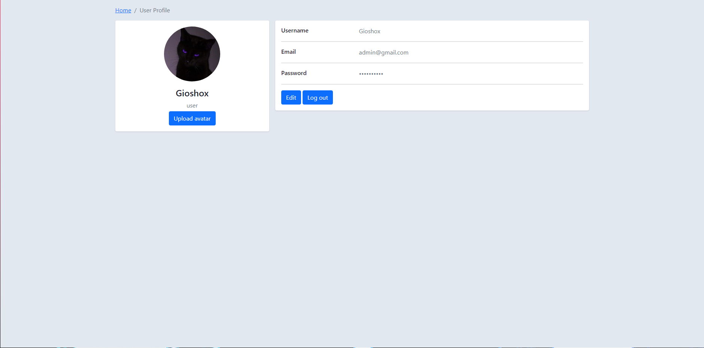
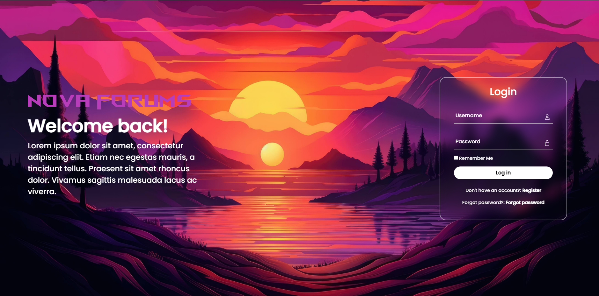
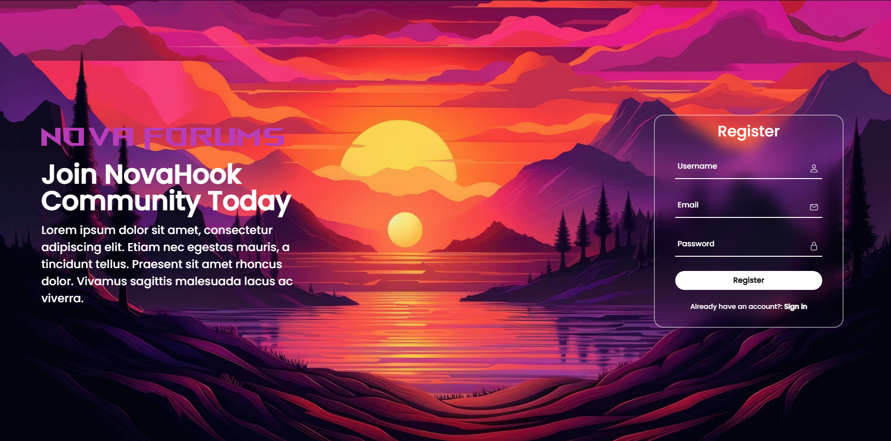

## Table of Contents
- [About](#about)
- [Features](#features)
- [Installation](#installation)
- [Credits](#credits)
- [Images](#images)
- [License](#license)

## About

This is an example website created for fun and educational purposes. It is not intended for production use (unless you really want to). The website serves as a codebase example that can be used by others as a reference for building their web applications.

## Features

**Functional Features**
- **Registration**: Users can create accounts.
- **Login**: Registered users can sign in.
- **Account Activation**: Users receive an activation code via email.
- **Profile Page**: Users can upload a profile picture and change their username.

## Installation

1. Import the `database.sql` file into your database. You can find this file in the `db` directory.
2. Configure the email activation system in `php/register.php`. Modify lines 50 and 55 to match your email configuration.
3. Optionally, customize the email message in `php/register.php`. Note that changing `$activate_link` may require additional configuration.
4. After completing these steps, your installation should be complete. If you encounter any issues, please feel free to create an issue on GitHub.

## Credits

This website utilizes the following templates and resources:

### Forms

- The sign-in and registration form template were developed by [Hash Techie](https://github.com/Hashtechieofficial/Form-). We extend our gratitude to the developer for their valuable contributions to this project.

### Profile Page

- The profile page template is provided by [Bootdey](https://www.bootdey.com/snippets/view/profile-with-data-and-skills). We appreciate their contribution to enhancing the user experience on our website.

### Frameworks and Libraries

- [Bootstrap 5](https://getbootstrap.com/): A popular front-end framework for creating responsive web interfaces.

### Icons

- [FontAwesome](https://fontawesome.com/): A library of icons and fonts that enhance the visual appeal of our web application.
- [unpkg](https://unpkg.com): A content delivery network (CDN) for serving web assets.

## Images

Here are some preview images from the website:

1.  - Profile Page
2.  - Login Page
3.  - Register Page

## License

This project is licensed under the MIT License. For details, please see the [LICENSE](LICENSE) file.